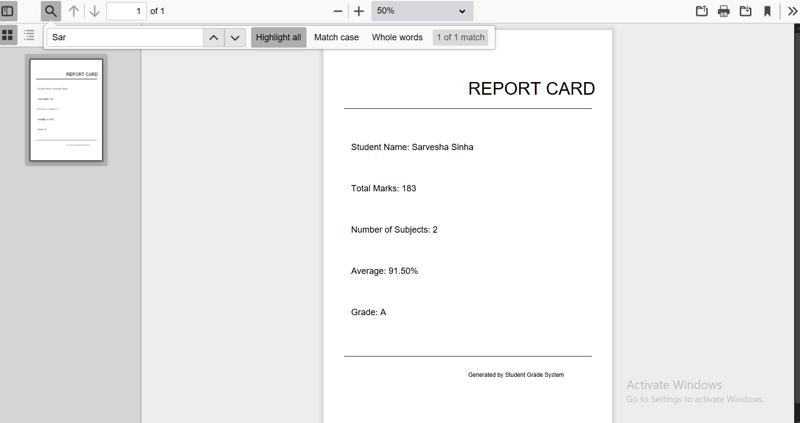

#  Student Grading System in Rust

A console application that generates student report cards with grade calculation and PDF export functionality.


## Features

- Input student details (name, total marks, subjects)
- Automatic average calculation
- Grade assignment (A/B/C/D)
- Console report card display
- PDF report generation (with `printpdf` crate)
- Interactive loop for multiple entries

##  Getting Started

### Prerequisites
- Rust 1.70+ ([install](https://www.rust-lang.org/tools/install))
- `printpdf` dependencies:
  ```bash
  # Ubuntu/Debian
  sudo apt install libfreetype6-dev

  # macOS (Homebrew)
  brew install freetype
  ```

## 🔧 Installation
```bash
git clone https://github.com/your-username/student_grading_system.git
cd student_grading_system
cargo build
```

## Running the Program
```bash
cargo run
```

##  Generating the PDF
- After entering the student details, a PDF report will be saved in the project directory.
- Ensure the `printpdf` crate is added in `Cargo.toml` for PDF support.

## Report Card Sample PDF
-

## Folder Structure
```text
student_grading_system/
├── src/
│   └── main.rs
├── Cargo.toml
├── Cargo.lock
```

## 📝 License
This project is licensed under the MIT License.


